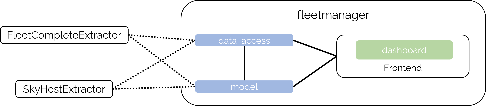
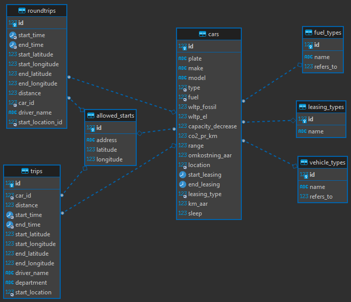

### Indledning
Dette repositorie indeholder simuleringstoolet som er udviklet i løbet af AI-signaturprojektet Intelligent flådestyring og klimasmarte kørselsmønstre (https://ifkk.syddjurs.dk/forside/). 

Dokumentationen er delt i to dele, en teknisk del rettet imod udviklere og leverandører og en anvendelsesorienteret rettet imod slutbrugere. Den tekniske del findes i det Github-repositorie som er tilknyttet projektet, https://andreasdroid.github.io/ifkkDoc/src/build/html/index.html. Den anvendelsesorienterede dokumentation findes i https://andreasdroid.github.io/ifkkDoc/src/build/ifkk_dokumentation.pdf.


### Repository oversigt
```
    ├───FleetCompleteExtractor  [Utilities til at trække data fra FleetComplete API - separat readme]
    ├───SkyHostExtractor        [Utilities til at trække data fra SkyHost API - separat readme]
    │   └───xml_templates
    └───src                     [Applikationskode]
        └───fleetmanager        [Applikationsmodul]
            ├───dashboard       [Frontend]
            │   ├───assets
            │   └───Components
            ├───data_access     [Backend data utilities]
            └───model           [Backend]
                ├───pogi        [Baggrund for CO2e]
                └───qampo       [Backend - Optimeringsalgortimer]
```


### Formål
Simuleringstoolet er udviklet med formål om at kunne tage en proaktiv tilgang til indkøb af køretøjsflåden for en flåde.
I dag foretages indkøb af køretøjer med begrænset input fra data. Målet er at kunne anvende den konkrete flådes data i form af kørte ture og køretøjsflåde til at simulere scenarier med forskellig sammensætning af køretøjsflåden.
Simuleringstoolet sammenligner den nuværende flåde med en fremtidig simuleret og giver informationer om kapaciteten i flåden og om forskelle i økonomiske, transportmæssige og udledningsmæssige-konsekvenser imellem de to flåder. <br>
Specifikt, deles applikationen op 3 typer simulering:
1. CO2e-orienteret simulering. En simulering, hvor køretøjer med lavere CO2e aftryk prioriteres. Giver ikke nødvendigs det absolutte lavest CO2e aftryk.
2. Intelligent simulering. En optimal simulering, hvor køretøjets variable pris pr. km. afvejes med dets CO2e aftryk. Her vægtes på køretøjets attributter således turene allokeres biler på den mest optimale måde.
3. Målsimulering. En optimering på flådesammensætning, hvor delflåden optimeres på både CO2e og omkostning og hvor flåden samtidig tilfredsstiller kørselsbehovet. 
### Teknisk overblik


Simuleringstoolet er udviklet i python på backenden og brugergrænsefladen er ligeledes opsat med python-biblioteket Dash.
Dokumentationen på de enkelte dele af koden er at finde i det tilhørende Github-projekt, https://github.com/syddjurs/IFKK eller på https://andreasdroid.github.io/ifkkDoc/src/build/html/index.html
#### Extractors
I dette repository findes to moduler udviklet for at trække data fra flådestyringssystemerne; FleetComplete `FleetCompleteExtractor` og SkyHost `SkyHostExtractor`.
De har hver deres readme og requirements filer. 
#### Applikationen
Selve applikationskoden findes under `src.fleetmanager`. Droids Agency har udviklet koden i dette repository i samarbejde med Qampo, der specifikt har udviklet optimeringsmodulet til "Intelligent simulering" - dette modul findes i `src/fleetmanager/model/qampo`.

### Sådan kommer du i gang
### Forudsætninger
Applikationen er testet på Windows og Linux. Applikationen er afhængig af en række biblioteker der kan ses i `src/requirements.txt`
Applikationen kræver Python >= 3.8. Den installerede version af Python kan checkes ved at køre følgende kommando i kommandolinjen i Windows:
```
C:\Users\user>python -V
Python 3.8.5
```

De nødvendige biblioteker kan installeres med pip:
```
pip install -r src/requirements.txt
```

Det er tiltænkt at installere applikationen som et python module for at lette import af moduler, der sker på tværs i applikation. <br>
Installation af modulerne fra rod med pip:
```
pip install -e
```

Applikationen forventer en database forbindelse, der trækkes fra environment variabler. Hvis de ikke findes, loades en SQLite database i memory med dummy data. <br>
Der kan med fordel oprettes en `.env` fil med værdierne, hvorfra variablerne vil blive loaded. 
```
DB_NAME=<database navn>
DB_PASSWORD=<database bruger password>
DB_USER=<database brugernavn>
DB_URL=<database url>
DB_SERVER='mysql'
```

For at køre applikationen og tilgå den via http://127.0.0.1:8050/ køres følgende.
```
cd src
python -m fleetmanager.dashboard

Dash is running on http://127.0.0.1:8050/

 * Serving Flask app 'fleetmanager.dashboard.app' (lazy loading)
 * Environment: production
   WARNING: This is a development server. Do not use it in a production deployment.
   Use a production WSGI server instead.
 * Debug mode: off
 * Running on http://127.0.0.1:8050/ (Press CTRL+C to quit)
```

### Data
Applikationen er afhængig af data på tilladte startsteder, biler (inkl. metadata) og ikke mindst rundture. I applikation run-time er alle tabeller påkrævet, 
på-nær: `trips` og `leasing_types`. `RoundTrips` vil altid kun indeholde GPS-koordinater der er tæt på det tilladte startsted (+- x antal meter, den tilladte distance defineret i extractor'en).
For at læse mere om hvor data stammer fra, hvilke forudsætninger der er og hvilke antagelser der laves, refereres til `FleetCompleteExtractor` eller `SkyhostExtractor` eller den fulde dokumentation på data og algortimer her: https://andreasdroid.github.io/ifkkDoc/src/build/ifkk_dokumentation.pdf   




